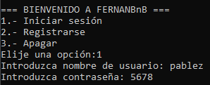

# FernanBnB Tema 3 José Ángel Soriano & David García
<h1>Índice</h1>
    <ol>
        <li>Introducción</li>
        <li>Instalación</li>
        <li>
            Menú principal
            <ol>
                <li>Registrarse</li>
                <li>
                    Iniciar sesión
                    <ul>
                        <li>
                            Perfil de propietario
                            <ol>
                                <li>Ver viviendas en alquiler</li>
                                <li>Añadir una vivienda</li>
                                <li>Eliminar una vivienda</li>
                                <li>Editar viviendas</li>
                                <li>Ver reservas de viviendas</li>
                                <li>Establecer periodo de no disponible para una vivienda</li>
                                <li>Ver datos del perfil</li>
                                <li>Modificar datos del perfil</li>
                                <li>Cerrar sesión</li>
                            </ol>
                        </li>
                        <li>
                            Perfil de usuario
                            <ol>
                                <li>Buscar alojamientos</li>
                                <li>Ver reservas realizadas</li>
                                <li>Cancelar reservas</li>
                                <li>Ver datos del perfil</li>
                                <li>Modificar datos del perfil</li>
                                <li>Cerrar sesión</li>
                            </ol>
                        </li>
                        <li>
                            Perfil de administrador
                            <ol>
                                <li>Ver todas las viviendas en alquiler</li>
                                <li>Ver todos los usuarios</li>
                                <li>Ver todas las reservas</li>
                                <li>Ver datos del perfil</li>
                                <li>Modificar datos del perfil</li>
                                <li>Cerrar sesión</li>
                            </ol>
                        </li>
                    </ul>
                </li>
                <li>Apagar</li>
            </ol>
        </li>
    </ol>
     
    <h1>Introducción</h1>
    
Presentamos la primera versión de FernanBnB, un programa que busca acercarse al funcionamiento básico de una web
        o app para gestionar el alquiler de viviendas.

    
Para agilizar las pruebas realizadas sobre el programa, se han establecido algunos datos por defecto: 

    <ul>
        <li>Un perfil de administrador con nombre de usuario "juanga" y contraseña "1234"</li>
        <li>Un perfil como propietario con nombre de usuario "pablez" y contraseña "5678", el cual contará con una
            vivienda registrada</li>
        <li>Un perfil como usuario con nombre de usuario "evavarro" y contraseña "9123", el cual contará con una reserva
            asignada a la vivienda previamente registrada</li>
    </ul>
     
    <h1>Instalación</h1>
    
Después de descargar la carpeta del programa, debemos asegurarnos de tener instalada alguna versión de Java para
        que pueda funcionar. Después, haremos doble click en el archivo "arranquePrograma" que se encuentra en la
        carpeta e iniciará el programa

    <h1>Menú principal</h1>
    
Al inciar el programa, nos encotraremos con el menú principal, en el que seleccionaremos las opciones deseadas
        tecleando el número correspondiente

    

    <h2>Registrarse</h2>
    
En esta sección, podremos registrarnos mediante una dirección e-mail que se haya registrado previamente.

    
Una vez comprobado que el e-mail introducido no está registrado con anterioridad, deberemos introducir los
        siguientes datos:

    

    
A continuación, elegiremos la función que tendrá el perfil. De ambas opciones, solo podrá haber dos perfiles
        registrados de cada tipo

    

    
Una vez elegida, se nos mostrará el perfil creado, con un código generado y asociado al perfil

    

     
    <h2>Inciciar sesión</h2>
    
Al elegir esta opción podremos iniciar sesión en nuestro perfil. Para ello, deberemos introducir nuestro nombre
        de usuario ("pablez") y contraseña ("5678")

    

    <h3>Perfil de propietario</h3>
    

     
    <h3>Ver viviendas en alquiler</h3>
    
Si el propietario tiene registrado una vivienda, este podrá ver los datos de esta

    

     
    <h3>Añadir una vivienda</h3>
    
Aquí podremos registrar una vivienda rellenando estos datos. <strong>UN PROPIETARIO SOLO PUEDE TENER REGISTRADA
            UNA VIVIENDA</strong>

    

     
    <h3>Eliminar una vivienda</h3>
    
Si el usuario tiene registrada una vivienda, está será borrada

     
    <h3>Editar una vivienda</h3>
    
Aquí podremos modificar los mismos datos que introdujimos al crear la vivienda

     
    <h3>Establecer un periodo de no disponible para una vivienda</h3>
    
Aquí deberemos asignar una fecha de inicio (con formato dd/mm/yyyy) y un número de noches para crear una reserva propia para la
        vivienda. Si dicha vivienda ya tiene dos reservas, no podrá realizarse otra más

        

        

     
    <h3>Ver mi perfil</h3>
    
Aquí podemos ver la información del perfil

    

     
    <h3>Modificar mi perfil</h3>
    
Aquí podemos modificar los distintos datos del perfil

    

     
    <h3>Cerrar sesión</h3>
    
Cierra la sesión y vuelve al menú principal

     
    <h3>Perfil de usuario</h3>
    

     
    <h3>Búsqueda de alojamientos <em>TODO</em></h3>
    
En esta opción buscaremos alojamientos que estén libres introduciendo la localidad, fecha de entrada, número de
        huéspedes y las noches de estancia, con la que sabremos la fecha de salida y el precio total

     
    <h3>Ver mis reservas <em>TODO</em></h3>
    
Aquí podemos ver las reservas que hemos realizado (máximo 2)

    

     
    <h3>Tanto la opción de ver el perfil, modificar perfil y cerrar sesión son las mismas que en el anterior menú</h3>
     
    <h3>Perfil de administrador</h3>
    

     
    <h3>Ver todas las viviendas en alquiler</h3>
    
Muestra todas las viviendas registradas (máximo 2)

    

     
    <h3>Ver todos los perfiles</h3>
    
Muestra todas los perfiles registrados (máximo 2 usuarios y 2 propietarios)

    

     
    <h3>Ver todas las reservas del sistema</h3>
    
Muestra las reservas realizadas actualmente (máximo 2 por vivienda)

    

     
    <h3>Tanto la opción de ver el perfil, modificar perfil y cerrar sesión son las mismas que en los demás perfiles</h3>
     
    <h2>Apagar</h2>
    
Apaga el programa por completo

